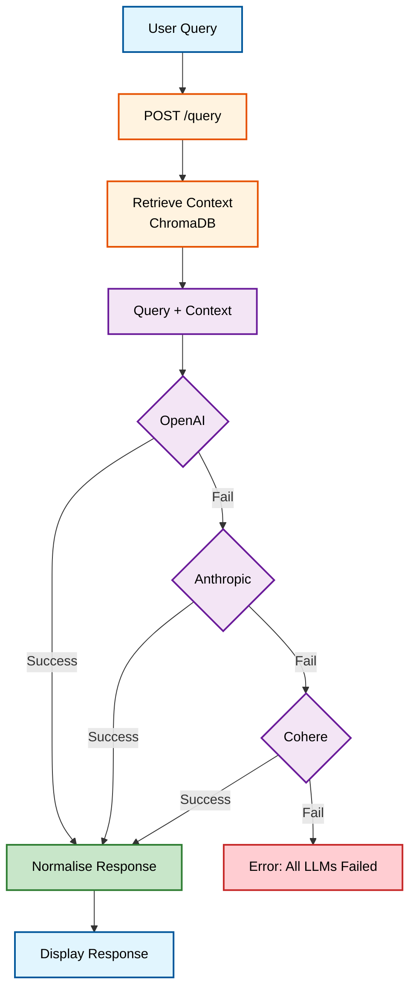

# Portfolio Project

This repository contains the code for a portfolio project built using React and Vite. The project showcases various components and features, including a theme toggle, read mode, and integration with multiple APIs.

## Live Diagram

You can view the live system design diagram for this project below:


## Features
- Dark and Light Theme Toggle
- Read Mode Context
- Integration with ChromaDB for context retrieval
- LLM Router Layer for handling multiple free-tier APIs

## Project Structure
```
backend/
├── main.py                # Entry point for the backend
├── bifrost_router.py      # LLM Router logic
├── rag.py                 # ChromaDB integration for context retrieval
├── .env                   # Environment variables (API keys, etc.)
├── requirements.txt       # Python dependencies
└── utils/
    ├── response_utils.py  # Utility functions for response normalization
    └── logger.py          # Logging utilities

src/
├── App.jsx                # Main React component
├── components/            # React components
│   ├── Navbar/            # Navbar component
│   ├── Hero/              # Hero section
│   ├── ThemeToggle/       # Theme toggle logic
│   └── ReadMode/          # Read mode logic
└── styles/                # Global styles
```

## Workflow Diagram

Below is the workflow diagram for the LLM Router process:



## Getting Started

### Prerequisites
- Node.js
- Python 3.9+

### Installation
1. Clone the repository:
   ```bash
   git clone https://github.com/your-username/portfolio.git
   ```
2. Navigate to the project directory:
   ```bash
   cd portfolio
   ```
3. Install frontend dependencies:
   ```bash
   npm install
   ```
4. Navigate to the backend directory:
   ```bash
   cd backend
   ```
5. Install backend dependencies:
   ```bash
   pip install -r requirements.txt
   ```

### Running the Project
1. Start the backend server:
   ```bash
   python main.py
   ```
2. Start the frontend development server:
   ```bash
   npm run dev
   ```

## License
This project is licensed under the MIT License.