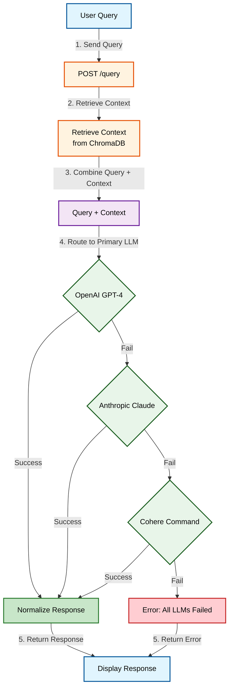

# Portfolio Project

This repository contains the code for a portfolio project built using React and Vite. The project showcases various components and features, including a theme toggle, read mode, and integration with multiple APIs.

## Live Diagram

You can view the live system design diagram for this project below:


## Features
- Dark and Light Theme Toggle
- Read Mode Context
- Integration with ChromaDB for context retrieval
- LLM Router Layer for handling multiple free-tier APIs

## Project Structure
```
backend/
├── main.py                # Entry point for the backend
├── bifrost_router.py      # LLM Router logic
├── rag.py                 # ChromaDB integration for context retrieval
├── .env                   # Environment variables (API keys, etc.)
├── requirements.txt       # Python dependencies
└── utils/
    ├── response_utils.py  # Utility functions for response normalization
    └── logger.py          # Logging utilities

src/
├── App.jsx                # Main React component
├── components/            # React components
│   ├── Navbar/            # Navbar component
│   ├── Hero/              # Hero section
│   ├── ThemeToggle/       # Theme toggle logic
│   └── ReadMode/          # Read mode logic
└── styles/                # Global styles
```

## Workflow Diagram

Below is the enhanced workflow diagram for the LLM Router process, providing a clear and detailed understanding of how user queries are processed:



### Explanation of the Workflow

1. **User Query**:
   - The user submits a query through the frontend interface.
   - The query is sent to the backend via a `POST /query` API call.

2. **Retrieve Context**:
   - The backend retrieves relevant context for the query using ChromaDB.
   - This ensures that the LLMs have the necessary information to generate accurate responses.

3. **Combine Query + Context**:
   - The query and retrieved context are combined into a single input for the LLM Router.

4. **LLM Routing**:
   - The router first sends the input to the primary LLM (OpenAI GPT-4).
   - If the primary LLM fails (e.g., timeout, rate limit), the router falls back to secondary LLMs (Anthropic Claude, Cohere Command).

5. **Normalize Response**:
   - The response from the LLM is normalized to ensure consistent formatting.

6. **Display Response**:
   - The normalized response is sent back to the frontend and displayed to the user.
   - If all LLMs fail, an error message is returned instead.

### Key Features of the Workflow
- **Fallback Mechanism**:
  - Ensures high availability by routing queries to multiple LLMs in case of failures.
- **Context-Aware Responses**:
  - Integrates ChromaDB to provide relevant context for more accurate responses.
- **Error Handling**:
  - Returns a user-friendly error message if all LLMs fail.
- **Scalability**:
  - The architecture can easily accommodate additional LLMs or context sources in the future.

## Getting Started

### Prerequisites
- Node.js
- Python 3.9+

### Installation
1. Clone the repository:
   ```bash
   git clone https://github.com/your-username/portfolio.git
   ```
2. Navigate to the project directory:
   ```bash
   cd portfolio
   ```
3. Install frontend dependencies:
   ```bash
   npm install
   ```
4. Navigate to the backend directory:
   ```bash
   cd backend
   ```
5. Install backend dependencies:
   ```bash
   pip install -r requirements.txt
   ```

### Running the Project
1. Start the backend server:
   ```bash
   python main.py
   ```
2. Start the frontend development server:
   ```bash
   npm run dev
   ```

## License
This project is licensed under the MIT License.